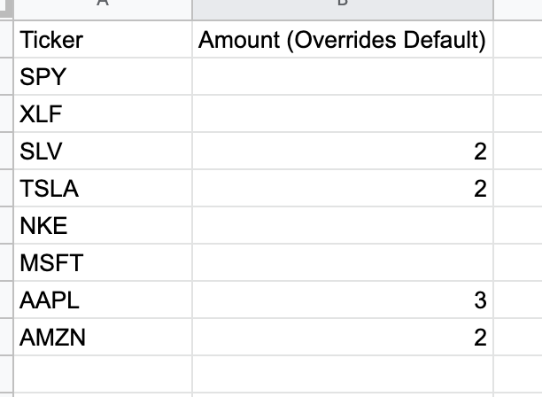

# Readme

Daily dollar cost averaging (DCA) using alpaca partial shares and their API.

Shares purchased based on input sources.

Investing is risky. I'm not a financial advisor. None of this is financial advice. Trade at your own risk.

# Quickstart

Download the project. Run `cp config.template.yml config.yml`. You'll be editing this config.yml file in the next steps

## Alpaca

Create an Alpaca account.

Follow instructions here to get your API keys.

https://medium.com/automation-generation/manually-trading-stocks-using-postman-and-the-alpaca-api-f45542d33143#:~:text=Getting%20your%20API%20Keys,can%20always%20regenerate%20your%20keys.

Update the live and paper secret keys with the keys you generated. I highly recommend you test this bot out in paper trading mode for a few risks.

When you want to trade live, set the environment to "live" in the config file. The creator assumes no responsibility or risk for your own trading activities.

## Default Amounts

You can change the default amounts for every service, set custom amounts for certain tickers, and set the default amounts for google sheets. Examples are in the example config file.

## Motely Fool Premium Serices

If you have rule breakers or stock advisors, put your credentials in the appropriate spots in config.yml. These credentials are never sent anywhere. If you have other premium services you want added, please let me know.

## Google Sheet

Here's an example Google Sheet.

If you have the cell blank, it will use the default amount as specified in the config.yml file.

Publish the Google Sheet to web as a CSV. Ensure access isn't restricted.

https://support.google.com/docs/answer/183965?co=GENIE.Platform%3DDesktop&hl=en

Copy the generated URL and put it in the correct spot in the config file.

## Running Locally

Install docker.

`docker build -t daily-dca-bot . && docker run daily-dca-bot`

## Running AWS

Create ECR repository

Follow the instructions to upload to the ECR repo

Create an ECS cluster

Create a task to run the uploaded docker container. No special configs are needed.

Create a scheduled task using the task you just created. I use the following cron expression. `cron(0 19 ? * MON-FRI *)`